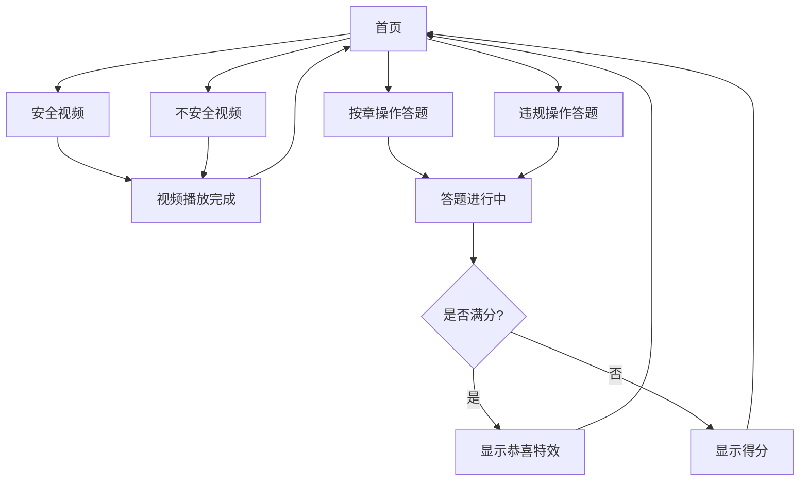

# 项目规划文档：安全管理交互页面

## 需求分析与完善

根据用户需求，本项目是一个安全管理交互页面系统，将部署在Cloudflare Workers上。系统包含4个主要页面：
1. 视频页面(安全版)：展示"遵守规章制度-安全"主题视频
2. 视频页面(不安全版)：展示"违规操作-不安全"主题视频
3. 答题页面(按章操作)：测试用户安全意识，满分展示恭喜特效
4. 答题页面(违规操作)：测试规避违章能力，满分展示恭喜特效

需求完善：
- 需明确视频链接来源
- 需确定10道题目内容及答案
- 建议添加首页作为导航入口
- 建议添加结果记录功能
- 增加适配PC端的布局设计

## 用户旅程设计

为确保良好的用户体验，系统设计了清晰的用户旅程流程：



## 界面原型设计

### 1. 首页布局
```
+------------------+
|    页面标题      |
+------------------+
|   [安全视频]    |
|                  |
|   [不安全视频]  |
|                  |
|   [按章答题]    |
|                  |
|   [违规答题]    |
+------------------+
```

### 2. 视频页面布局
```
+------------------+
|   视频标题       |
+------------------+
|                  |
|    视频播放     |
|     区域        |
|                  |
+------------------+
|   返回按钮      |
+------------------+
```

### 3. 答题页面布局
```
+------------------+
|   题目 (1/10)   |
+------------------+
|   问题描述...    |
+------------------+
|   □ 选项A       |
|   □ 选项B       |
|   □ 选项C       |
|   □ 选项D       |
+------------------+
|   提交按钮      |
+------------------+
```

### 4. 恭喜特效设计
```
+------------------+
|    🎉 恭喜 🎉    |
|                  |
|   满分通过！    |
|                  |
|   [动画效果]    |
|                  |
|   返回首页      |
+------------------+
```

## 项目架构设计

采用单页应用(SPA)设计，使用纯HTML、CSS和JavaScript实现。整体架构如下：

```
安全管理交互页面
│
├── 核心模块
│   ├── 路由管理 - 控制页面切换
│   ├── 状态管理 - 管理应用状态
│   └── 工具函数 - 公共函数库
│
├── 页面组件
│   ├── 首页组件 - 导航入口
│   ├── 视频播放组件 - 处理视频播放逻辑
│   └── 答题组件 - 处理答题逻辑
│
└── 资源管理
    ├── 样式资源 - CSS样式
    ├── 问题库 - 存储题目数据(Cloudflare KV)
    └── 特效资源 - 存储恭喜特效资源
```

## 目标分解

□ 搭建基础项目框架，实现SPA路由系统
□ 实现首页导航界面，提供四个主要功能入口
□ 开发视频播放组件，支持自动全屏功能
□ 实现两个不同主题的视频页面
□ 开发答题组件，支持题目展示、选择和评分
□ 实现两个不同主题的答题页面
□ 设计并实现恭喜特效系统
□ 开发结果统计和展示功能
□ 优化移动端体验，确保在手机上正常运行
□ 测试和调试，确保系统稳定可靠
□ 打包部署到Cloudflare Workers
□ 在Cloudflare KV中配置题库数据

## 详细实现规划

### 模块一：核心系统

#### 功能描述
实现单页应用框架，包括路由系统、状态管理和基础工具函数。

#### 函数设计

```javascript
/**
 * 初始化应用程序
 * 功能：设置初始状态，加载必要资源，启动路由系统
 */
function initApp() {
    // 初始化应用状态
    // 注册路由事件
    // 加载初始页面
}

/**
 * 路由管理器
 * 功能：控制页面跳转，维护历史记录
 * 参数：route - 目标路由
 * 返回值：无
 */
function navigateTo(route) {
    // 保存当前状态
    // 更新URL
    // 加载对应页面组件
}

/**
 * 状态管理器
 * 功能：管理全局状态数据
 * 参数：key - 状态键名, value - 状态值
 * 返回值：无
 */
function setState(key, value) {
    // 更新状态
    // 触发UI更新
}

/**
 * 获取应用状态
 * 功能：获取指定状态数据
 * 参数：key - 状态键名
 * 返回值：状态值
 */
function getState(key) {
    // 返回指定状态
}
```

### 模块二：页面组件

#### 功能描述
实现各个页面的UI组件和交互逻辑。

#### 函数设计

```javascript
/**
 * 渲染首页
 * 功能：显示四个主要功能入口
 * 参数：container - 容器元素
 * 返回值：无
 */
function renderHomePage(container) {
    // 创建页面元素
    // 绑定事件处理程序
    // 添加到容器
}

/**
 * 渲染视频页面
 * 功能：全屏播放视频
 * 参数：container - 容器元素, videoType - 视频类型(安全/不安全)
 * 返回值：无
 */
function renderVideoPage(container, videoType) {
    // 创建视频元素
    // 获取视频源
    const videoUrl = videoSources[videoType];
    
    // 创建视频嵌入HTML
    const videoHTML = `
    <div style="padding: 56.25% 0 0 0; position: relative">
        <div style="height:100%;left:0;position:absolute;top:0;width:100%">
            <iframe height="100%" width="100%;" src="${videoUrl}" 
            frameborder="0" allow="autoplay; fullscreen" scrolling="no"></iframe>
        </div>
    </div>`;
    
    // 将视频添加到容器
    container.innerHTML = videoHTML;
    
    // 检测移动设备并启用全屏
    if (getState('deviceType') === 'mobile') {
        enableFullscreen(container.querySelector('iframe'));
    }
}

/**
 * 播放视频
 * 功能：控制视频播放逻辑
 * 参数：videoElement - 视频元素, autoFullscreen - 是否自动全屏
 * 返回值：无
 */
function playVideo(videoElement, autoFullscreen) {
    // 播放视频
    // 根据参数启用全屏
    // 监听播放完成事件
    
    // 嵌入式视频iframe由Wave.video提供自动播放功能
    if (autoFullscreen) {
        enableFullscreen(videoElement);
    }
    
    // 监听视频消息事件，用于检测播放结束
    window.addEventListener('message', (event) => {
        // 假设Wave.video在播放结束时发送特定消息
        if (event.data && event.data.type === 'videoEnded') {
            navigateTo('home'); // 视频结束后返回首页
        }
    });
}

/**
 * 渲染答题页面
 * 功能：显示题目并处理答题逻辑
 * 参数：container - 容器元素, quizType - 答题类型(按章操作/违规操作)
 * 返回值：无
 */
function renderQuizPage(container, quizType) {
    // 显示加载状态
    container.innerHTML = '<div class="loading">加载中...</div>';
    
    // 加载题库
    loadQuestions(quizType)
        .then(questions => {
            if (questions.length === 0) {
                container.innerHTML = '<div class="error">题库加载失败</div>';
                return;
            }
            
            // 恢复上次答题进度
            const savedProgress = loadProgress(quizType);
            if (savedProgress) {
                setState('answers', savedProgress);
            }
            
            // 创建答题界面
            createQuizInterface(container, questions, quizType);
            
            // 启动计时器
            startQuizTimer();
        })
        .catch(error => {
            container.innerHTML = `<div class="error">出错了：${error.message}</div>`;
        });
}

/**
 * 创建答题界面
 * 功能：构建答题页面UI和交互
 * 参数：container - 容器元素, questions - 题目数组, quizType - 答题类型
 * 返回值：无
 */
function createQuizInterface(container, questions, quizType) {
    const currentIndex = getState('questionIndex');
    const question = questions[currentIndex];
    
    // 构建答题界面HTML
    const html = `
        <div class="quiz-container">
            <div class="progress-bar">
                <div class="progress" style="width: ${(currentIndex + 1) * 10}%"></div>
            </div>
            <div class="question-counter">题目 ${currentIndex + 1}/10</div>
            <div class="timer">剩余时间: <span id="countdown">300</span>秒</div>
            <div class="question">${question.question}</div>
            <div class="options">
                ${question.options.map((option, idx) => `
                    <div class="option" data-index="${idx}">
                        <input type="radio" name="answer" value="${idx}" id="option${idx}">
                        <label for="option${idx}">${option}</label>
                    </div>
                `).join('')}
            </div>
            <button class="submit-btn" disabled>提交答案</button>
        </div>
    `;
    
    container.innerHTML = html;
    
    // 绑定事件处理
    bindQuizEvents(container, questions, quizType);
}

/**
 * 启动答题计时器
 * 功能：为答题设置倒计时
 * 返回值：无
 */
function startQuizTimer() {
    let timeLeft = 300; // 5分钟
    const timerElement = document.getElementById('countdown');
    
    const timer = setInterval(() => {
        timeLeft--;
        timerElement.textContent = timeLeft;
        
        if (timeLeft <= 0) {
            clearInterval(timer);
            handleTimeUp();
        }
    }, 1000);
    
    // 保存timer ID以便清理
    setState('currentTimer', timer);
}

/**
 * 处理答题超时
 * 功能：处理答题时间用完的情况
 * 返回值：无
 */
function handleTimeUp() {
    const answers = getState('answers');
    const quizType = getState('quizType');
    
    // 自动提交当前答案
    calculateScore(answers, quizType).then(score => {
        showResults(score);
    });
}

/**
 * 显示答题结果
 * 功能：展示答题分数和反馈
 * 参数：score - 得分对象 {score, total, isPerfect}
 * 返回值：无
 */
function showResults(score) {
    const container = document.querySelector('.quiz-container');
    
    if (score.isPerfect) {
        showCongratulations(container);
    } else {
        container.innerHTML = `
            <div class="results">
                <h2>答题完成</h2>
                <div class="score">得分：${score.score}/${score.total}</div>
                <div class="feedback">继续努力，争取满分！</div>
                <button onclick="navigateTo('home')">返回首页</button>
            </div>
        `;
    }
}

/**
 * 显示题目
 * 功能：展示单个题目
 * 参数：question - 题目数据, container - 容器元素, index - 题目序号
 * 返回值：无
 */
function displayQuestion(question, container, index) {
    // 创建题目元素
    // 显示题目内容和选项
    // 绑定选项点击事件
}

/**
 * 评分系统
 * 功能：计算答题分数并显示结果
 * 参数：answers - 用户答案, quizType - 答题类型
 * 返回值：分数对象 {score, total, isPerfect}
 */
function calculateScore(answers, quizType) {
    // 获取正确答案
    // 比对用户答案
    // 计算得分
    // 判断是否满分
}

/**
 * 显示特效
 * 功能：展示恭喜特效
 * 参数：container - 容器元素, quizType - 答题类型
 * 返回值：无
 */
function showCongratulations(container) {
    // 创建特效容器
    container.innerHTML = `
        <div class="congratulations">
            <div class="firework-container"></div>
            <h1 class="congrats-title">🎉 恭喜通过！🎉</h1>
            <div class="score-perfect">满分！</div>
            <div class="stars"></div>
            <button onclick="navigateTo('home')" class="home-btn">返回首页</button>
        </div>
    `;

    // 添加烟花特效
    createFireworks(container.querySelector('.firework-container'));
    
    // 添加星星动画
    createStars(container.querySelector('.stars'));
    
    // 播放音效
    playCongratsSound();
}

/**
 * 创建烟花特效
 * 功能：使用Canvas创建烟花动画
 * 参数：container - 特效容器
 * 返回值：无
 */
function createFireworks(container) {
    const canvas = document.createElement('canvas');
    const ctx = canvas.getContext('2d');
    
    // 设置画布尺寸
    canvas.width = container.clientWidth;
    canvas.height = container.clientHeight;
    container.appendChild(canvas);
    
    // 烟花粒子类
    class Particle {
        constructor(x, y, color) {
            this.x = x;
            this.y = y;
            this.color = color;
            this.velocity = {
                x: Math.random() * 6 - 3,
                y: Math.random() * 6 - 3
            };
            this.alpha = 1;
        }
        
        draw() {
            ctx.beginPath();
            ctx.arc(this.x, this.y, 2, 0, Math.PI * 2);
            ctx.fillStyle = `rgba(${this.color}, ${this.alpha})`;
            ctx.fill();
        }
        
        update() {
            this.x += this.velocity.x;
            this.y += this.velocity.y;
            this.alpha -= 0.01;
            this.draw();
        }
    }
    
    // 创建烟花
    function createFirework(x, y) {
        const particles = [];
        const colors = [
            '255, 182, 193', // 粉红
            '255, 215, 0',   // 金色
            '0, 191, 255'    // 蓝色
        ];
        
        for (let i = 0; i < 50; i++) {
            particles.push(new Particle(
                x,
                y,
                colors[Math.floor(Math.random() * colors.length)]
            ));
        }
        return particles;
    }
    
    // 动画循环
    let fireworks = [];
    let animationFrame;
    
    function animate() {
        animationFrame = requestAnimationFrame(animate);
        ctx.fillStyle = 'rgba(0, 0, 0, 0.1)';
        ctx.fillRect(0, 0, canvas.width, canvas.height);
        
        // 随机创建新烟花
        if (Math.random() < 0.05) {
            const x = Math.random() * canvas.width;
            const y = Math.random() * canvas.height;
            fireworks = fireworks.concat(createFirework(x, y));
        }
        
        // 更新和绘制粒子
        fireworks = fireworks.filter(particle => {
            particle.update();
            return particle.alpha > 0;
        });
        
        // 如果没有活跃的粒子，停止动画
        if (fireworks.length === 0) {
            cancelAnimationFrame(animationFrame);
        }
    }
    
    // 启动动画
    animate();
}

/**
 * 创建星星动画
 * 功能：添加闪烁的星星背景
 * 参数：container - 星星容器
 * 返回值：无
 */
function createStars(container) {
    // 创建多个星星元素
    for (let i = 0; i < 20; i++) {
        const star = document.createElement('div');
        star.className = 'star';
        star.style.left = `${Math.random() * 100}%`;
        star.style.top = `${Math.random() * 100}%`;
        star.style.animationDelay = `${Math.random() * 2}s`;
        container.appendChild(star);
    }
}

/**
 * 播放音效
 * 功能：播放恭喜音效
 * 返回值：无
 */
function playCongratsSound() {
    const audio = new Audio('/assets/congrats.mp3');
    audio.play().catch(error => {
        console.log('自动播放被阻止:', error);
    });
}

// 添加相关CSS样式
const congratsStyles = `
.congratulations {
    position: fixed;
    top: 0;
    left: 0;
    width: 100%;
    height: 100%;
    display: flex;
    flex-direction: column;
    justify-content: center;
    align-items: center;
    background: rgba(0, 0, 0, 0.9);
    z-index: 1000;
}

.firework-container {
    position: absolute;
    top: 0;
    left: 0;
    width: 100%;
    height: 100%;
    z-index: -1;
}

.congrats-title {
    font-size: 2.5em;
    color: #fff;
    text-align: center;
    margin-bottom: 20px;
    animation: bounce 1s ease infinite;
}

.score-perfect {
    font-size: 1.8em;
    color: #ffd700;
    margin-bottom: 30px;
    animation: pulse 2s ease infinite;
}

.home-btn {
    padding: 15px 30px;
    font-size: 1.2em;
    background: #4CAF50;
    color: white;
    border: none;
    border-radius: 25px;
    cursor: pointer;
    transition: transform 0.3s ease;
}

.home-btn:hover {
    transform: scale(1.1);
}

.star {
    position: absolute;
    width: 4px;
    height: 4px;
    background: #fff;
    border-radius: 50%;
    animation: twinkle 1s ease infinite;
}

@keyframes bounce {
    0%, 100% { transform: translateY(0); }
    50% { transform: translateY(-20px); }
}

@keyframes pulse {
    0%, 100% { opacity: 1; }
    50% { opacity: 0.5; }
}

@keyframes twinkle {
    0%, 100% { opacity: 1; }
    50% { opacity: 0.3; }
}
`;

// 将样式添加到文档中
const styleSheet = document.createElement('style');
styleSheet.textContent = congratsStyles;
document.head.appendChild(styleSheet);
```

### 模块三：资源管理

#### 功能描述
管理应用所需的各种资源，包括样式、问题库和特效资源。

#### 函数设计

```javascript
/**
 * 加载问题库
 * 功能：从Cloudflare KV获取指定类型的题目数据
 * 参数：quizType - 答题类型(按章操作/违规操作)
 * 返回值：Promise<问题数组>
 */
async function loadQuestions(quizType) {
    try {
        // 从Cloudflare KV获取题库数据
        const questionsJson = await NAMESPACE.get('Test_Title');
        if (!questionsJson) {
            throw new Error('题库数据不存在');
        }
        
        // 解析JSON
        const questions = JSON.parse(questionsJson);
        
        // 返回对应类型的题目
        return questions[quizType] || [];
    } catch (error) {
        console.error('加载题库失败:', error);
        // 返回空数组或默认题目
        return [];
    }
}

/**
 * 加载特效资源
 * 功能：加载恭喜特效所需资源
 * 参数：effectType - 特效类型
 * 返回值：特效资源对象
 */
function loadEffects(effectType) {
    // 返回特效资源
}
```

### 模块四：响应式设计

#### 功能描述
确保应用在不同设备上的正确显示和功能。

#### 函数设计

```javascript
/**
 * 检测设备类型
 * 功能：判断当前访问设备类型
 * 返回值：设备类型字符串 ('mobile', 'tablet', 'desktop')
 */
function detectDevice() {
    // 检测设备类型
    // 返回对应字符串
}

/**
 * 适配屏幕
 * 功能：根据设备类型调整布局
 * 参数：deviceType - 设备类型
 * 返回值：无
 */
function adaptToScreen(deviceType) {
    // 根据设备类型应用不同样式
    // 调整交互方式
}

/**
 * 启用全屏
 * 功能：将指定元素切换到全屏模式
 * 参数：element - 目标元素
 * 返回值：是否成功切换到全屏模式
 */
function enableFullscreen(element) {
    // 跨浏览器全屏API支持
    if (element.requestFullscreen) {
        element.requestFullscreen();
    } else if (element.webkitRequestFullscreen) { /* Safari */
        element.webkitRequestFullscreen();
    } else if (element.msRequestFullscreen) { /* IE11 */
        element.msRequestFullscreen();
    }
    
    // 检查是否成功进入全屏
    return document.fullscreenElement !== null ||
           document.webkitFullscreenElement !== null ||
           document.msFullscreenElement !== null;
}

/**
 * 退出全屏
 * 功能：退出全屏模式
 * 返回值：无
 */
function exitFullscreen() {
    if (document.exitFullscreen) {
        document.exitFullscreen();
    } else if (document.webkitExitFullscreen) { /* Safari */
        document.webkitExitFullscreen();
    } else if (document.msExitFullscreen) { /* IE11 */
        document.msExitFullscreen();
    }
}
```

### 模块五：离线支持

#### 功能描述
确保应用在网络不可用时仍能提供基本功能。

#### 函数设计

```javascript
/**
 * 初始化离线支持
 * 功能：注册Service Worker并缓存必要资源
 * 返回值：Promise
 */
async function initOfflineSupport() {
    if ('serviceWorker' in navigator) {
        try {
            const registration = await navigator.serviceWorker.register('/sw.js');
            console.log('Service Worker 注册成功:', registration);
        } catch (error) {
            console.error('Service Worker 注册失败:', error);
        }
    }
}

/**
 * 缓存管理器
 * 功能：管理本地缓存数据
 */
const CacheManager = {
    /**
     * 保存题库到本地
     * 参数：questions - 题库数据
     * 返回值：Promise
     */
    async saveQuestionsToCache(questions) {
        try {
            localStorage.setItem('cached_questions', JSON.stringify(questions));
            localStorage.setItem('questions_cache_time', Date.now());
        } catch (error) {
            console.error('缓存题库失败:', error);
        }
    },

    /**
     * 从本地获取题库
     * 返回值：Promise<题库数据>
     */
    async getQuestionsFromCache() {
        try {
            const cached = localStorage.getItem('cached_questions');
            const cacheTime = localStorage.getItem('questions_cache_time');
            
            // 检查缓存是否过期（24小时）
            if (cached && cacheTime && (Date.now() - cacheTime) < 24 * 60 * 60 * 1000) {
                return JSON.parse(cached);
            }
            return null;
        } catch (error) {
            console.error('读取缓存题库失败:', error);
            return null;
        }
    },

    /**
     * 保存答题进度
     * 参数：quizType - 答题类型, answers - 答案数组
     * 返回值：无
     */
    saveProgress(quizType, answers) {
        try {
            localStorage.setItem(`quiz_progress_${quizType}`, JSON.stringify(answers));
        } catch (error) {
            console.error('保存进度失败:', error);
        }
    },

    /**
     * 加载答题进度
     * 参数：quizType - 答题类型
     * 返回值：答案数组或null
     */
    loadProgress(quizType) {
        try {
            const saved = localStorage.getItem(`quiz_progress_${quizType}`);
            return saved ? JSON.parse(saved) : null;
        } catch (error) {
            console.error('加载进度失败:', error);
            return null;
        }
    }
};

/**
 * 修改后的题库加载函数
 * 功能：优先从本地缓存加载题库，失败则从服务器加载
 * 参数：quizType - 答题类型
 * 返回值：Promise<问题数组>
 */
async function loadQuestions(quizType) {
    try {
        // 先尝试从缓存加载
        const cachedQuestions = await CacheManager.getQuestionsFromCache();
        if (cachedQuestions) {
            return cachedQuestions[quizType] || [];
        }
        
        // 缓存不可用时从服务器加载
        const questionsJson = await NAMESPACE.get('Test_Title');
        if (!questionsJson) {
            throw new Error('题库数据不存在');
        }
        
        const questions = JSON.parse(questionsJson);
        
        // 保存到缓存
        await CacheManager.saveQuestionsToCache(questions);
        
        return questions[quizType] || [];
    } catch (error) {
        console.error('加载题库失败:', error);
        // 返回默认题目
        return getDefaultQuestions(quizType);
    }
}

/**
 * 获取默认题目
 * 功能：当无法加载题库时提供基础题目
 * 参数：quizType - 答题类型
 * 返回值：基础题目数组
 */
function getDefaultQuestions(quizType) {
    // 返回一些基础的安全相关题目
    return [
        {
            id: 'default1',
            question: '安全生产最重要的是什么？',
            options: [
                '提高效率',
                '遵守规章制度',
                '完成任务',
                '技术创新'
            ],
            correctAnswer: 1,
            explanation: '遵守规章制度是安全生产的基础'
        }
        // 可以添加更多默认题目...
    ];
}
```

### Service Worker 实现

创建 `sw.js` 文件：

```javascript
const CACHE_NAME = 'safety-quiz-v1';
const CACHE_URLS = [
    '/',
    '/index.html',
    '/styles.css',
    '/app.js'
];

// Service Worker 安装
self.addEventListener('install', event => {
    event.waitUntil(
        caches.open(CACHE_NAME)
            .then(cache => cache.addAll(CACHE_URLS))
    );
});

// 缓存优先策略
self.addEventListener('fetch', event => {
    event.respondWith(
        caches.match(event.request)
            .then(response => response || fetch(event.request))
    );
});
```

## 数据结构设计

### 应用状态

```javascript
const appState = {
    currentPage: 'home', // 当前页面
    videoType: null, // 当前视频类型
    quizType: null, // 当前答题类型
    answers: [], // 用户答案
    score: null, // 分数
    questionIndex: 0, // 当前题目索引
    deviceType: 'mobile' // 设备类型
};
```

### 视频源

```javascript
const videoSources = {
    compliant: "", // 安全视频URL（待定）
    nonCompliant: "" // 不安全视频URL（待定）
};
```

### Cloudflare KV题库设计

题库将存储在Cloudflare KV空间中，变量名为`Test_Title`，值为JSON格式的题库数据。JSON结构设计如下：

```javascript
// 题库JSON结构
{
  "compliant": [ // 按章操作题库
    {
      "id": "c1", // 题目ID
      "question": "在高空作业时，以下哪种做法是正确的？", // 题目内容
      "options": [ // 四个选项
        "使用未经检查的安全带",
        "正确佩戴安全帽和安全带",
        "为了工作方便不系安全带",
        "穿着拖鞋进行作业"
      ],
      "correctAnswer": 1, // 正确选项索引（从0开始）
      "explanation": "正确佩戴安全帽和安全带是高空作业的基本安全要求" // 解释说明
    },
    {
      "id": "c2",
      "question": "发现设备故障时，正确的做法是？",
      "options": [
        "继续使用并等待自然修复",
        "自行拆卸维修",
        "立即停止使用并报告主管",
        "找同事询问是否可以继续使用"
      ],
      "correctAnswer": 2,
      "explanation": "设备故障应立即停止使用并报告主管，由专业人员处理"
    },
    // ...更多题目
  ],
  "nonCompliant": [ // 违规操作题库
    {
      "id": "nc1",
      "question": "在没有安全措施的情况下，如何避免电气设备带电作业的风险？",
      "options": [
        "穿绝缘鞋并使用绝缘工具",
        "确保手部干燥",
        "先切断电源再进行作业",
        "快速完成作业减少接触时间"
      ],
      "correctAnswer": 2,
      "explanation": "带电作业前必须切断电源，是最基本的安全规范"
    },
    // ...更多题目
  ]
}
```

### 路由配置

```javascript
const routes = {
    home: {
        render: renderHomePage
    },
    video: {
        render: renderVideoPage,
        params: ['videoType']
    },
    quiz: {
        render: renderQuizPage,
        params: ['quizType']
    },
    result: {
        render: renderResultPage,
        params: ['quizType', 'score']
    }
};
```

## 部署规划

最终将所有代码合并到一个文件中，包含HTML、CSS和JavaScript。该文件适合部署到Cloudflare Workers。建议采用以下结构：

```html
<!DOCTYPE html>
<html>
<head>
    <meta charset="UTF-8">
    <meta name="viewport" content="width=device-width, initial-scale=1.0">
    <title>安全管理交互页面</title>
    <style>
        /* CSS样式 */
    </style>
</head>
<body>
    <div id="app"></div>
    <script>
        // JavaScript代码
    </script>
</body>
</html>
```

## Cloudflare Workers配置

### 1. 创建wrangler.toml配置文件

```toml
name = "safety-quiz"
type = "webpack"
account_id = "your_account_id"
workers_dev = true
route = ""
zone_id = ""

[site]
bucket = "./public"
entry-point = "workers-site"

[build]
command = "npm run build"
upload.format = "service-worker"

[build.upload]
dir = "dist"

[env.production]
name = "safety-quiz-prod"
route = "your.domain.com/*"

[env.staging]
name = "safety-quiz-staging"
route = "staging.your.domain.com/*"

# KV命名空间配置
kv_namespaces = [
  { binding = "NAMESPACE", id = "your_namespace_id", preview_id = "your_preview_namespace_id" }
]
```

### 2. Worker脚本配置

创建`worker.js`文件：

```javascript
import { getAssetFromKV } from '@cloudflare/kv-asset-handler'

addEventListener('fetch', event => {
  event.respondWith(handleRequest(event))
})

async function handleRequest(event) {
  try {
    // 处理API请求
    if (event.request.url.includes('/api/')) {
      return await handleApiRequest(event.request)
    }
    
    // 处理静态资源
    return await getAssetFromKV(event, {
      cacheControl: {
        browserTTL: 60 * 60 * 24, // 24小时浏览器缓存
        edgeTTL: 60 * 60 * 24 * 365 // 365天边缘缓存
      }
    })
  } catch (e) {
    return new Response('Error: ' + e.message, { status: 500 })
  }
}

async function handleApiRequest(request) {
  const url = new URL(request.url)
  
  // 获取题库数据
  if (url.pathname === '/api/questions') {
    try {
      const questions = await NAMESPACE.get('Test_Title')
      return new Response(questions, {
        headers: {
          'Content-Type': 'application/json',
          'Cache-Control': 'public, max-age=3600'
        }
      })
    } catch (error) {
      return new Response(JSON.stringify({ error: '获取题库失败' }), {
        status: 500,
        headers: { 'Content-Type': 'application/json' }
      })
    }
  }
  
  return new Response('Not Found', { status: 404 })
}
```

### 3. KV命名空间设置步骤

1. 创建KV命名空间：
```bash
wrangler kv:namespace create "QUIZ_NAMESPACE"
```

2. 获取命名空间ID并添加到wrangler.toml：
```toml
kv_namespaces = [
  { binding = "NAMESPACE", id = "xxx" }
]
```

3. 创建预览命名空间：
```bash
wrangler kv:namespace create "QUIZ_NAMESPACE_PREVIEW" --preview
```

4. 添加预览命名空间ID：
```toml
kv_namespaces = [
  { binding = "NAMESPACE", id = "xxx", preview_id = "yyy" }
]
```

### 4. 部署步骤

1. 安装wrangler CLI：
```bash
npm install -g @cloudflare/wrangler
```

2. 登录Cloudflare账号：
```bash
wrangler login
```

3. 构建项目：
```bash
npm run build
```

4. 发布到Workers：
```bash
wrangler publish
```

### 5. 环境变量配置

在Cloudflare Workers的环境变量中设置：

```
ENVIRONMENT=production
ALLOWED_ORIGINS=https://your.domain.com
API_TOKEN=your_api_token
```

### 6. 安全配置

1. 配置CORS策略：
```javascript
const corsHeaders = {
  'Access-Control-Allow-Origin': '*',
  'Access-Control-Allow-Methods': 'GET, POST, OPTIONS',
  'Access-Control-Allow-Headers': 'Content-Type'
}

function handleOptions(request) {
  return new Response(null, {
    headers: corsHeaders
  })
}
```

2. 配置安全头：
```javascript
const securityHeaders = {
  'Content-Security-Policy': "default-src 'self'; img-src 'self' data: https:; media-src 'self' https:;",
  'X-XSS-Protection': '1; mode=block',
  'X-Frame-Options': 'DENY',
  'X-Content-Type-Options': 'nosniff',
  'Referrer-Policy': 'strict-origin-when-cross-origin'
}
```

### 7. 监控和日志

1. 配置Workers分析：
```javascript
addEventListener('fetch', event => {
  const start = Date.now()
  
  event.respondWith(
    handleRequest(event).then(response => {
      const end = Date.now()
      
      // 记录响应时间
      console.log(`Request processed in ${end - start}ms`)
      
      return response
    })
  )
})
```

2. 错误跟踪：
```javascript
addEventListener('error', event => {
  // 发送错误到监控系统
  console.error('Worker错误:', event.message)
})
```

此配置提供了完整的部署环境，包括开发、预览和生产环境的设置，以及必要的安全措施和监控功能。

## 开发环境配置

### 1. 项目依赖

```json
{
    "name": "safety-quiz",
    "version": "1.0.0",
    "dependencies": {
        "@cloudflare/kv-asset-handler": "^0.3.0",
        "@cloudflare/wrangler": "^3.0.0",
        "webpack": "^5.88.0",
        "webpack-cli": "^5.1.0"
    },
    "devDependencies": {
        "jest": "^29.0.0",
        "prettier": "^3.0.0",
        "eslint": "^8.0.0"
    },
    "scripts": {
        "dev": "wrangler dev",
        "build": "webpack --mode production",
        "test": "jest",
        "format": "prettier --write .",
        "lint": "eslint ."
    }
}
```

### 2. 开发工具配置

#### ESLint配置
```json
{
    "extends": ["eslint:recommended"],
    "env": {
        "browser": true,
        "es2021": true,
        "worker": true
    },
    "rules": {
        "no-console": ["error", { "allow": ["warn", "error"] }],
        "no-unused-vars": "warn"
    }
}
```

#### Prettier配置
```json
{
    "semi": true,
    "singleQuote": true,
    "tabWidth": 2,
    "printWidth": 100
}
```

## 测试计划

### 1. 单元测试

使用Jest进行单元测试，重点测试以下组件：

```javascript
// 路由测试
describe('Router', () => {
    test('should navigate to correct page', () => {
        navigateTo('quiz');
        expect(getState('currentPage')).toBe('quiz');
    });
});

// 答题逻辑测试
describe('Quiz', () => {
    test('should calculate score correctly', () => {
        const answers = [1, 2, 1, 3];
        const score = calculateScore(answers, 'compliant');
        expect(score.total).toBe(4);
    });
});

// 特效组件测试
describe('Congratulations', () => {
    test('should create firework particles', () => {
        const particles = createFirework(100, 100);
        expect(particles.length).toBe(50);
    });
});
```

### 2. 集成测试

```javascript
describe('Application Flow', () => {
    test('complete quiz flow', async () => {
        // 初始化应用
        await initApp();
        
        // 导航到答题页面
        navigateTo('quiz');
        
        // 模拟答题
        const answers = [1, 1, 1, 1];
        submitAnswers(answers);
        
        // 验证结果
        const score = getState('score');
        expect(score).toBeDefined();
    });
});
```

### 3. 性能测试

使用Lighthouse进行性能测试，目标指标：
- First Contentful Paint (FCP) < 1.5s
- Time to Interactive (TTI) < 3.0s
- Cumulative Layout Shift (CLS) < 0.1

## 错误处理策略

### 1. 全局错误处理

```javascript
window.onerror = function(message, source, lineno, colno, error) {
    console.error('全局错误:', {
        message,
        source,
        lineno,
        colno,
        error
    });
    
    // 显示用户友好的错误提示
    showErrorNotification('系统遇到问题，请刷新重试');
    
    return true;
};

// 处理Promise异常
window.onunhandledrejection = function(event) {
    console.error('未处理的Promise异常:', event.reason);
    showErrorNotification('操作失败，请重试');
};
```

### 2. 业务错误处理

```javascript
class BusinessError extends Error {
    constructor(code, message) {
        super(message);
        this.code = code;
    }
}

const ErrorCodes = {
    QUIZ_NOT_FOUND: 'QUIZ_001',
    INVALID_ANSWER: 'QUIZ_002',
    VIDEO_LOAD_FAILED: 'VIDEO_001'
};

function handleBusinessError(error) {
    if (error instanceof BusinessError) {
        switch (error.code) {
            case ErrorCodes.QUIZ_NOT_FOUND:
                showErrorNotification('题库加载失败，请刷新重试');
                break;
            case ErrorCodes.INVALID_ANSWER:
                showErrorNotification('答案格式不正确');
                break;
            case ErrorCodes.VIDEO_LOAD_FAILED:
                showErrorNotification('视频加载失败，请检查网络连接');
                break;
            default:
                showErrorNotification('操作失败，请重试');
        }
    } else {
        console.error('未知错误:', error);
        showErrorNotification('系统错误，请联系管理员');
    }
}
```

## 性能优化指南

### 1. 资源优化

```javascript
// 图片懒加载
function lazyLoadImages() {
    const images = document.querySelectorAll('img[data-src]');
    const imageObserver = new IntersectionObserver((entries, observer) => {
        entries.forEach(entry => {
            if (entry.isIntersecting) {
                const img = entry.target;
                img.src = img.dataset.src;
                observer.unobserve(img);
            }
        });
    });
    
    images.forEach(img => imageObserver.observe(img));
}

// 代码分割
const routeComponents = {
    home: () => import('./components/Home.js'),
    quiz: () => import('./components/Quiz.js'),
    video: () => import('./components/Video.js')
};
```

### 2. 缓存策略

```javascript
// 静态资源缓存
const CACHE_CONFIG = {
    images: {
        maxAge: 7 * 24 * 60 * 60, // 7天
        staleWhileRevalidate: 24 * 60 * 60 // 1天
    },
    fonts: {
        maxAge: 30 * 24 * 60 * 60 // 30天
    },
    scripts: {
        maxAge: 24 * 60 * 60 // 1天
    }
};

// 应用缓存清理
function clearAppCache() {
    if ('caches' in window) {
        caches.keys().then(cacheNames => {
            return Promise.all(
                cacheNames.map(cacheName => {
                    if (cacheName.startsWith('app-')) {
                        return caches.delete(cacheName);
                    }
                })
            );
        });
    }
}
```

## 部署规划

最终将所有代码合并到一个文件中，包含HTML、CSS和JavaScript。该文件适合部署到Cloudflare Workers。建议采用以下结构：

```html
<!DOCTYPE html>
<html>
<head>
    <meta charset="UTF-8">
    <meta name="viewport" content="width=device-width, initial-scale=1.0">
    <title>安全管理交互页面</title>
    <style>
        /* CSS样式 */
    </style>
</head>
<body>
    <div id="app"></div>
    <script>
        // JavaScript代码
    </script>
</body>
</html>
```

## Cloudflare Workers配置

### 1. 创建wrangler.toml配置文件

```toml
name = "safety-quiz"
type = "webpack"
account_id = "your_account_id"
workers_dev = true
route = ""
zone_id = ""

[site]
bucket = "./public"
entry-point = "workers-site"

[build]
command = "npm run build"
upload.format = "service-worker"

[build.upload]
dir = "dist"

[env.production]
name = "safety-quiz-prod"
route = "your.domain.com/*"

[env.staging]
name = "safety-quiz-staging"
route = "staging.your.domain.com/*"

# KV命名空间配置
kv_namespaces = [
  { binding = "NAMESPACE", id = "your_namespace_id", preview_id = "your_preview_namespace_id" }
]
```

### 2. Worker脚本配置

创建`worker.js`文件：

```javascript
import { getAssetFromKV } from '@cloudflare/kv-asset-handler'

addEventListener('fetch', event => {
  event.respondWith(handleRequest(event))
})

async function handleRequest(event) {
  try {
    // 处理API请求
    if (event.request.url.includes('/api/')) {
      return await handleApiRequest(event.request)
    }
    
    // 处理静态资源
    return await getAssetFromKV(event, {
      cacheControl: {
        browserTTL: 60 * 60 * 24, // 24小时浏览器缓存
        edgeTTL: 60 * 60 * 24 * 365 // 365天边缘缓存
      }
    })
  } catch (e) {
    return new Response('Error: ' + e.message, { status: 500 })
  }
}

async function handleApiRequest(request) {
  const url = new URL(request.url)
  
  // 获取题库数据
  if (url.pathname === '/api/questions') {
    try {
      const questions = await NAMESPACE.get('Test_Title')
      return new Response(questions, {
        headers: {
          'Content-Type': 'application/json',
          'Cache-Control': 'public, max-age=3600'
        }
      })
    } catch (error) {
      return new Response(JSON.stringify({ error: '获取题库失败' }), {
        status: 500,
        headers: { 'Content-Type': 'application/json' }
      })
    }
  }
  
  return new Response('Not Found', { status: 404 })
}
```

### 3. KV命名空间设置步骤

1. 创建KV命名空间：
```bash
wrangler kv:namespace create "QUIZ_NAMESPACE"
```

2. 获取命名空间ID并添加到wrangler.toml：
```toml
kv_namespaces = [
  { binding = "NAMESPACE", id = "xxx" }
]
```

3. 创建预览命名空间：
```bash
wrangler kv:namespace create "QUIZ_NAMESPACE_PREVIEW" --preview
```

4. 添加预览命名空间ID：
```toml
kv_namespaces = [
  { binding = "NAMESPACE", id = "xxx", preview_id = "yyy" }
]
```

### 4. 部署步骤

1. 安装wrangler CLI：
```bash
npm install -g @cloudflare/wrangler
```

2. 登录Cloudflare账号：
```bash
wrangler login
```

3. 构建项目：
```bash
npm run build
```

4. 发布到Workers：
```bash
wrangler publish
```

### 5. 环境变量配置

在Cloudflare Workers的环境变量中设置：

```
ENVIRONMENT=production
ALLOWED_ORIGINS=https://your.domain.com
API_TOKEN=your_api_token
```

### 6. 安全配置

1. 配置CORS策略：
```javascript
const corsHeaders = {
  'Access-Control-Allow-Origin': '*',
  'Access-Control-Allow-Methods': 'GET, POST, OPTIONS',
  'Access-Control-Allow-Headers': 'Content-Type'
}

function handleOptions(request) {
  return new Response(null, {
    headers: corsHeaders
  })
}
```

2. 配置安全头：
```javascript
const securityHeaders = {
  'Content-Security-Policy': "default-src 'self'; img-src 'self' data: https:; media-src 'self' https:;",
  'X-XSS-Protection': '1; mode=block',
  'X-Frame-Options': 'DENY',
  'X-Content-Type-Options': 'nosniff',
  'Referrer-Policy': 'strict-origin-when-cross-origin'
}
```

### 7. 监控和日志

1. 配置Workers分析：
```javascript
addEventListener('fetch', event => {
  const start = Date.now()
  
  event.respondWith(
    handleRequest(event).then(response => {
      const end = Date.now()
      
      // 记录响应时间
      console.log(`Request processed in ${end - start}ms`)
      
      return response
    })
  )
})
```

2. 错误跟踪：
```javascript
addEventListener('error', event => {
  // 发送错误到监控系统
  console.error('Worker错误:', event.message)
})
```

此配置提供了完整的部署环境，包括开发、预览和生产环境的设置，以及必要的安全措施和监控功能。 